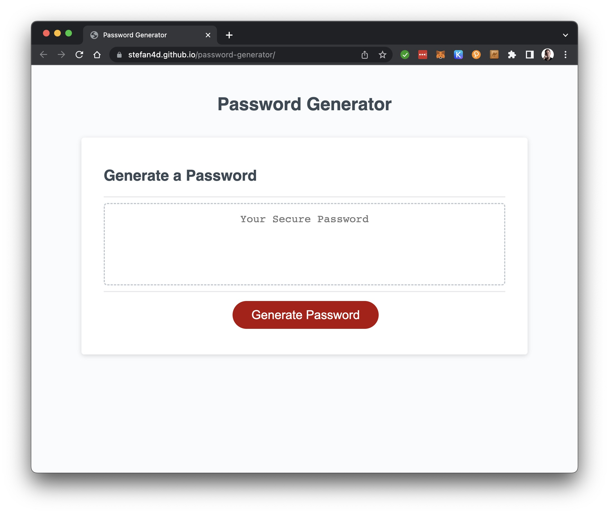

# Password Generator

## Description

Submission for Module 5 of the University of Birmingham Skills Bootcamp in Front-End Web Development &amp; UX.

This assignment took a starter code package in commit [db8da22](https://github.com/Stefan4D/password-generator/commit/db8da22cf85def13dc63e7718dd0582a5265da2f) and developed it to meet the defined acceptance criteria.

The production website is deployed [here](https://stefan4d.github.io/password-generator/).

This has been developed to meet the following Acceptance Criteria:

| Acceptance Criteria                                                                                                                                                                                                                                                                                 | Solution |
| --------------------------------------------------------------------------------------------------------------------------------------------------------------------------------------------------------------------------------------------------------------------------------------------------- | -------- |
| Generate a password when the button is clicked                                                                                                                                                                                                                                                      | Evidence |
| Present a series of prompts for password criteria - Length of password &nbsp;&nbsp;- At least 8 characters but no more than 128. - Character types &nbsp;&nbsp;- Lowercase &nbsp;&nbsp;- Uppercase &nbsp;&nbsp;- Numeric &nbsp;&nbsp;- Special characters ($@%&\_, etc) | Evidence |
| Code should validate for each input and at least one character type should be selected                                                                                                                                                                                                              | Evidence |
| Once prompts are answered then the password should be generated and displayed in an alert or written to the page                                                                                                                                                                                    | Evidence |

## Learning Outcomes

- Learned about implementing default values to prevent errors when using destructuring to obtain the returned values from a function.
- Learned about using a `null` return value in a ternary function. Although it works in this scenario, I know that I need to be careful as the value is returned so may need to be handled in other applications.
- Practiced, through trial and error, implementing using for() loops and swapping out where required to implement a while() loop instead as it better suited the program logic.
- Re-learned to remember to cover the 'else' scenario even when I think I'm using a guard clause! (The fact I needed to return an empty array to handle downstream errors).
- Practiced more use of logical OR (`||`) for setting default return values from a function and for checking multiple conditions at once in my generatePassword function.
- Practiced using ES6 destructuring to make my code more readable rather than using array[0] syntax when obtaining values from my getPasswordOptions function.

## Resources Used

In completing this challenge exercise, I made use of the following resources:

- [Samantha Ming: 3 Ways to Set Default Value in JavaScript](https://www.samanthaming.com/tidbits/52-3-ways-to-set-default-value/)

## Mark Scheme Compliance

### Technical Acceptance Criteria

| Item                                                                                                                                                            | Evidence                                                                                                                    |
| --------------------------------------------------------------------------------------------------------------------------------------------------------------- | --------------------------------------------------------------------------------------------------------------------------- |
| Satisfies all of the above acceptance criteria.   The challenge should not produce any errors in the console when you inspect it using Chrome DevTools. | The built application satisfies the acceptance criteria, as set out above.  There are no errors in Chrome DevTools. |

### Deployment

| Item                                              | Evidence                                                                     |
| ------------------------------------------------- | ---------------------------------------------------------------------------- |
| Application deployed at live URL.                 | Live application deployed at: https://stefan4d.github.io/password-generator/ |
| Application loads with no errors.                 | No visual defects   No console errors                                   |
| Application GitHub URL submitted.                 | URL submitted                                                                |
| GitHub repository that contains application code. | This repository contains all code.                                           |

### Application Quality

| Item                                                                                    | Evidence                                                                                                                                            |
| --------------------------------------------------------------------------------------- | --------------------------------------------------------------------------------------------------------------------------------------------------- |
| Application user experience is intuitive and easy to navigate.                          | Application makes use of native `window.prompt()` functionality within the browser.                                                                 |
| Application user interface style is clean and polished.                                 | Application user interface matches the original starter code and uses the standard browser window API for `window.prompt()` and `window.confirm()`. |
| Application resembles the mock-up functionality provided in the Challenge instructions. | Application resembles the mock-up.                                                                                                                  |

### Repository Quality

| Item                                                                                                    | Evidence                                                                                                                                                                                                     |
| ------------------------------------------------------------------------------------------------------- | ------------------------------------------------------------------------------------------------------------------------------------------------------------------------------------------------------------ |
| Repository has a unique name.                                                                           | Unique name used                                                                                                                                                                                             |
| Repository follows best practices for file structure and naming conventions.                            | Standard file naming conventions used                                                                                                                                                                        |
| Repository follows best practices for class/id naming conventions, indentation, quality comments, etc.  | All multi-word variables used camelCase   Indentation within code follows best practice    Comments have been included within the files to describe behaviour and/or intent of the code. |
| Repository contains multiple descriptive commit messages.                                               | Multiple commits included demonstrating incremental build of final submission. Each has a clear description of changes made.                                                                                 |
| Repository contains quality README file with description, screenshot, and link to deployed application. | This README document.                                                                                                                                                                                        |

## License

Released under the MIT license. Full details in [LICENSE](./LICENSE).
